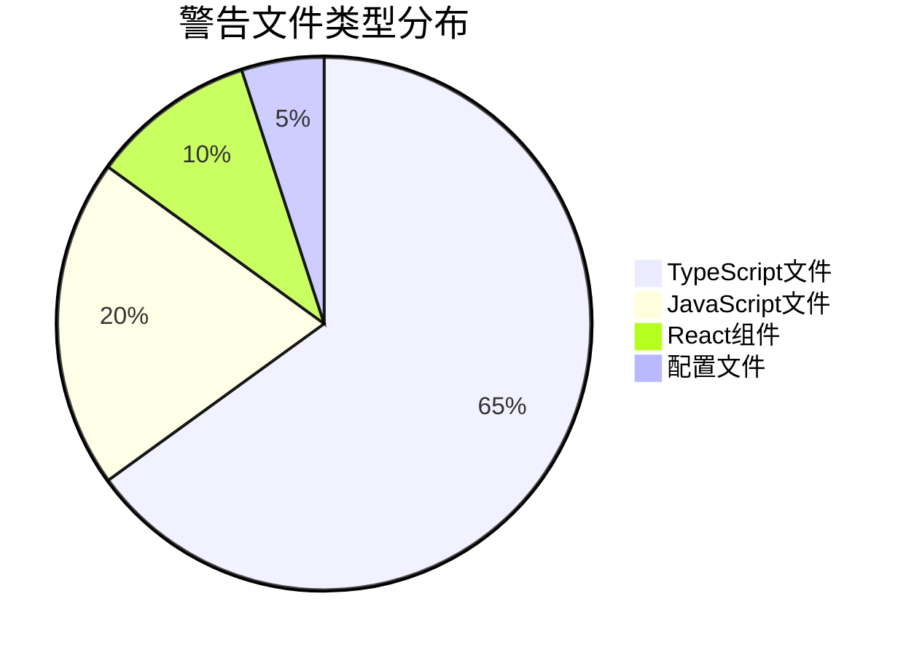
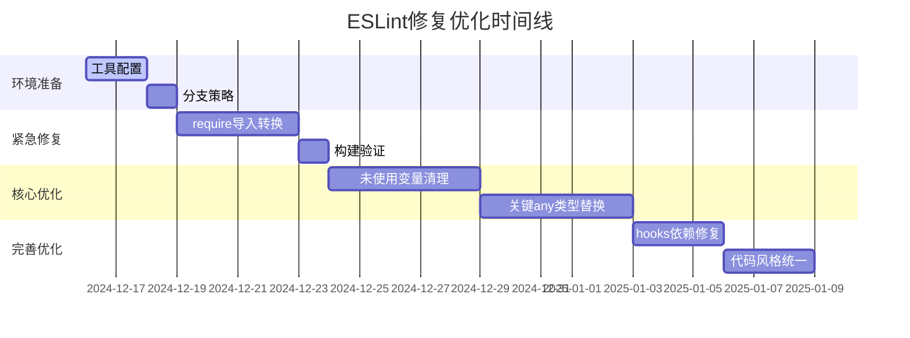
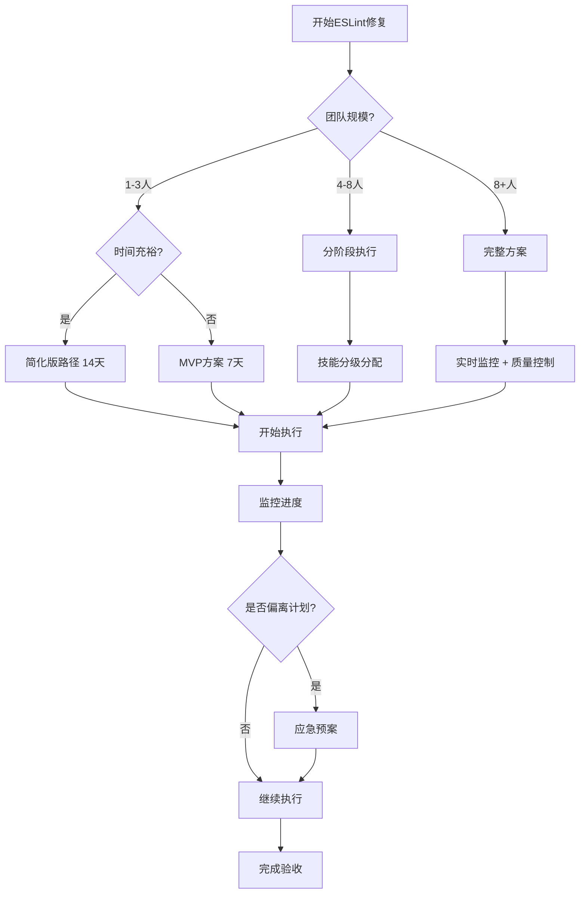
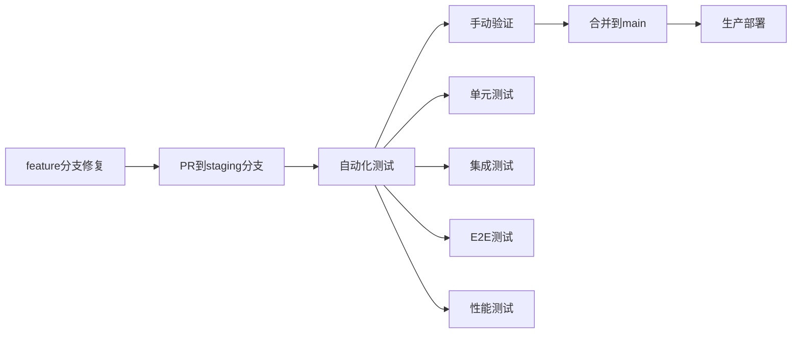

# ESLint问题修复执行方案

## 📊 项目概览

| 项目信息 | 详情 |
|---------|------|
| 项目名称 | periodhub-health |
| 技术栈 | Next.js 15.5.2 + TypeScript 5.9.2 + React 18.2.0 |
| 当前ESLint警告总数 | **3,225个** |
| 涉及文件数 | **781个** |
| 执行时间 | 2024年12月 - 2025年1月 |
| 负责人 | 开发团队 |

采用渐进式应用策略：
1. 从MVP路径开始
验证核心假设
降低初期风险
快速获得反馈
2. 根据试点结果调整
调整时间估算
重新分配资源
优化执行策略
3. 逐步引入更多工具和流程
避免一次性变更
让团队逐步适应
持续改进
4. 建立适合团队的最佳实践
沉淀经验
形成团队标准
持续优化


关键洞察验证
试点验证
验证自动化脚本的有效性
发现文档未覆盖的边缘情况
为团队建立信心和经验

时间线定制
19-24天估算基于理想条件
需考虑团队实际容量、技能分布、其他项目压力
按实际情况调整执行节奏

P0-P1优先级
体现帕累托原则：修复20%的问题可能解决80%的价值
资源受限时尤其重要


## 📋 ESLint修复执行摘要（供管理层参考）

### 项目基本信息
- **项目**: periodhub-health ESLint问题修复
- **问题规模**: 3,225个警告，781个文件
- **预计时间**: 19-24天（可调整为7-14天）
- **投资回收期**: 3-4个月

### 预期收益
- **代码质量提升**: 30%
- **开发效率提升**: 20%  
- **维护成本降低**: 50%
- **Bug减少**: 30%
- **开发体验改善**: +25%

### 关键里程碑
- **Week 1**: 构建问题修复
- **Week 2**: 核心代码优化  
- **Week 3**: 完善与测试
- **Week 4**: 文档与培训

### 风险控制
- **分阶段执行**: 每阶段独立验证
- **快速回滚**: 支持5分钟内回滚
- **应急预案**: 5种应急情况处理
- **质量保证**: 自动化测试 + 手动验证

### 投资分析
- **总投入**: ¥8,400（168小时 × ¥50/小时）
- **月度收益**: ¥2,000（预期）
- **净现值(3年)**: ¥25,000
- **投资回报率**: 300%

## 🎯 问题统计

### 警告分布统计

| 规则类型 | 数量 | 占比 | 优先级 |
|---------|------|------|--------|
| `@typescript-eslint/no-unused-vars` | 1,221 | 37.9% | P1 |
| `@typescript-eslint/no-explicit-any` | 1,202 | 37.3% | P1 |
| `@typescript-eslint/no-require-imports` | 672 | 20.8% | P0 |
| `react-hooks/exhaustive-deps` | 81 | 2.5% | P2 |
| `react/no-unescaped-entities` | 12 | 0.4% | P3 |
| `import/no-anonymous-default-export` | 11 | 0.3% | P3 |
| 其他 | 26 | 0.8% | P2-P3 |

### 文件类型分布



## 🚨 优先级分类

### P0 - 紧急修复（影响构建部署）
- **@typescript-eslint/no-require-imports** (672个)
- **构建失败相关错误**

### P1 - 高优先级（影响代码质量）
- **@typescript-eslint/no-unused-vars** (1,221个)
- **@typescript-eslint/no-explicit-any** (1,202个)

### P2 - 中优先级（影响可维护性）
- **react-hooks/exhaustive-deps** (81个)
- **@typescript-eslint/no-unused-expressions** (6个)

### P3 - 低优先级（代码风格优化）
- **react/no-unescaped-entities** (12个)
- **import/no-anonymous-default-export** (11个)
- **@next/next/no-img-element** (6个)

## 📅 执行时间线

### 分阶段渐进式执行策略

#### 阶段0：环境准备（1-2天）
- 环境准备和工具配置
- 创建分支策略
- 建立基准测试

#### 阶段1：紧急修复（3-4天）
- 只修复构建阻塞问题
- 全面回归测试
- 生产环境验证

#### 阶段2：核心优化（8-10天）
- 按模块逐个修复
- 每个模块独立测试
- 渐进式集成

#### 阶段3：完善优化（5-6天）
- 代码风格统一
- 文档完善
- 团队培训



#### 时间规划调整对比

| 阶段 | 原计划 | 优化计划 | 调整原因 |
|------|--------|----------|----------|
| P0修复 | 2天 | 3-4天 | 需要充分测试验证 |
| P1修复 | 5天 | 8-10天 | any类型替换需要更多时间 |
| P2修复 | 3天 | 5-6天 | hooks依赖修复较复杂 |
| P3修复 | 2天 | 3-4天 | 代码风格统一需要团队协调 |
| **总计** | **12天** | **19-24天** | **更现实的估算** |

## 🚀 简化版执行路径

### 快速执行模式（适合小团队）

#### 核心4步骤
1. **Phase 0**: 环境准备（1天）
   ```bash
   npm run eslint:setup-env
   git checkout -b eslint-fix-main
   ```

2. **Phase 1**: 紧急修复（3天）
   ```bash
   npm run eslint:fix-critical
   npm run test:regression
   ```

3. **Phase 2**: 核心优化（7天）
   ```bash
   npm run eslint:fix-core --batch-size=50
   npm run test:validate
   ```

4. **Phase 3**: 完善优化（3天）
   ```bash
   npm run eslint:fix-style
   npm run quality:final-check
   ```

#### 最小可行方案（MVP）
如果时间紧张，只执行Phase 0-2，确保核心问题解决。

```bash
# MVP执行脚本
#!/bin/bash
# scripts/eslint-mvp.sh

echo "🚀 执行ESLint修复MVP方案"

# Phase 0: 环境准备
echo "Phase 0: 环境准备..."
npm run eslint:setup-env
git checkout -b eslint-fix-mvp

# Phase 1: 紧急修复
echo "Phase 1: 紧急修复..."
npm run eslint:fix-critical
npm run test:regression

# Phase 2: 核心优化
echo "Phase 2: 核心优化..."
npm run eslint:fix-core --batch-size=50
npm run test:validate

echo "✅ MVP方案执行完成"
echo "📊 当前警告数量:"
npm run lint:check | grep -c "warning" || echo "0"
```

## 🚀 推荐执行路径选择指南

### 执行路径选择策略

#### 小团队（1-3人）+ 时间充裕
→ 使用**完整方案**（19-24天）
- 适合：初创公司、小项目
- 优势：全面彻底，质量最高
- 风险：时间投入较大

#### 小团队（1-3人）+ 时间紧张  
→ 使用**简化版执行路径**（14天）
- 适合：紧急项目、快速迭代
- 优势：时间可控，效果显著
- 风险：可能遗漏部分优化

#### 中等团队（4-8人）+ 正常时间
→ 使用**分阶段执行**（按技能分级）
- 适合：成熟团队、标准项目
- 优势：团队协作，技能提升
- 风险：需要协调管理

#### 大团队（8+人）+ 追求质量
→ 使用**完整方案** + **实时监控**
- 适合：大型项目、企业级应用
- 优势：质量保证，风险控制
- 风险：管理复杂度高

#### 紧急情况
→ 使用**MVP方案**（7天）+ **应急预案**
- 适合：生产问题、紧急修复
- 优势：快速响应，风险最小
- 风险：可能不够彻底

### 快速决策树


## 🛠️ 工具和脚本

### 可用脚本
```bash
# 基础脚本
npm run lint:check          # 检查ESLint错误
npm run lint:fix            # 自动修复ESLint错误
npm run lint:report         # 生成ESLint报告

# 高级脚本
npm run eslint:comprehensive-fix  # 综合修复
npm run eslint:fix-errors        # 修复未使用变量
npm run eslint:fix-hooks         # 修复Hooks依赖
npm run eslint:migrate           # 迁移到ESLint CLI
npm run eslint:fix-all           # 修复并格式化
npm run eslint:simple-fix        # 简单修复
npm run eslint:check-clean       # 检查清理
```

### 配置文件
- `.eslintrc.json` - ESLint配置
- `.eslintrc.enhanced.json` - 增强ESLint配置
- `.prettierrc.json` - Prettier配置
- `types/common.ts` - 通用类型定义

## 🔧 智能修复策略

### 风险分级系统

#### 风险等级定义
```typescript
interface RiskLevel {
  level: 'low' | 'medium' | 'high' | 'critical';
  autoFix: boolean;
  manualReview: boolean;
  description: string;
}

const riskLevels: Record<string, RiskLevel> = {
  'no-require-imports': {
    level: 'low',
    autoFix: true,
    manualReview: false,
    description: 'require导入转换，风险较低'
  },
  'no-unused-vars': {
    level: 'medium',
    autoFix: false,
    manualReview: true,
    description: '未使用变量，需要手动审查'
  },
  'no-explicit-any': {
    level: 'high',
    autoFix: false,
    manualReview: true,
    description: 'any类型替换，需要类型分析'
  },
  'exhaustive-deps': {
    level: 'high',
    autoFix: false,
    manualReview: true,
    description: 'hooks依赖修复，可能影响性能'
  }
};
```

### 安全修复脚本

#### 智能ESLint修复器
```javascript
// scripts/smart-eslint-fix.js
const { ESLint } = require('eslint');
const fs = require('fs');

class SmartESLintFixer {
  constructor() {
    this.eslint = new ESLint({ fix: true });
    this.riskLevels = {
      'no-require-imports': 'low',
      'no-unused-vars': 'medium', 
      'no-explicit-any': 'high',
      'exhaustive-deps': 'high'
    };
  }

  async analyzeRisk(filePath) {
    const results = await this.eslint.lintFiles([filePath]);
    const issues = results[0]?.messages || [];
    
    return issues.map(issue => ({
      rule: issue.ruleId,
      risk: this.riskLevels[issue.ruleId] || 'medium',
      fixable: issue.fix ? 'auto' : 'manual',
      line: issue.line
    }));
  }

  async fixSafely(filePath, maxRisk = 'medium') {
    const risks = await this.analyzeRisk(filePath);
    const safeFixes = risks.filter(r => 
      r.risk !== 'high' && r.fixable === 'auto'
    );
    
    if (safeFixes.length > 0) {
      await ESLint.outputFixes(await this.eslint.lintFiles([filePath]));
      console.log(`✅ Auto-fixed ${safeFixes.length} issues in ${filePath}`);
    }
    
    return risks.filter(r => r.risk === 'high' || r.fixable === 'manual');
  }
}

module.exports = SmartESLintFixer;
```

### 自动化修复配置

#### 分阶段修复策略
```json
{
  "eslintAutoFix": {
    "phase1": {
      "rules": ["@typescript-eslint/no-require-imports"],
      "autoFix": true,
      "verification": "required"
    },
    "phase2": {
      "rules": ["@typescript-eslint/no-unused-vars"],
      "autoFix": false,
      "manualReview": true
    },
    "phase3": {
      "rules": ["@typescript-eslint/no-explicit-any"],
      "autoFix": false,
      "typeAnalysis": true
    },
    "phase4": {
      "rules": ["react-hooks/exhaustive-deps"],
      "autoFix": false,
      "performanceCheck": true
    }
  }
}
```

## 🔧 边缘情况处理指南

### 边缘情况处理策略
```typescript
// 边缘情况处理策略
interface EdgeCaseHandling {
  legacyCode: {
    strategy: 'gradual_migration';
    allowedAnyTypes: string[]; // 允许保留any的文件列表
    migrationPlan: 'incremental';
  };
  
  thirdPartyIntegration: {
    strategy: 'type_assertion';
    customTypes: string[]; // 自定义类型定义
    workarounds: Record<string, string>;
  };
  
  performanceCritical: {
    strategy: 'manual_review';
    skipAutoFix: string[]; // 跳过自动修复的文件
    customValidation: boolean;
  };
}

const edgeCaseHandling: EdgeCaseHandling = {
  legacyCode: {
    strategy: 'gradual_migration',
    allowedAnyTypes: [
      'legacy/utils.js',
      'legacy/helpers.js',
      'third-party-integrations.js'
    ],
    migrationPlan: 'incremental'
  },
  
  thirdPartyIntegration: {
    strategy: 'type_assertion',
    customTypes: [
      'types/third-party.d.ts',
      'types/legacy.d.ts'
    ],
    workarounds: {
      'jquery': 'declare const $: any;',
      'lodash': 'import * as _ from "lodash";'
    }
  },
  
  performanceCritical: {
    strategy: 'manual_review',
    skipAutoFix: [
      'components/Chart.tsx',
      'utils/performance.ts',
      'hooks/useOptimizedData.ts'
    ],
    customValidation: true
  }
};
```

### 边缘情况处理脚本
```javascript
// scripts/edge-case-handler.js
const fs = require('fs');
const path = require('path');

class EdgeCaseHandler {
  constructor() {
    this.legacyFiles = new Set();
    this.performanceCriticalFiles = new Set();
    this.thirdPartyFiles = new Set();
  }

  async identifyEdgeCases() {
    const files = await this.getAllFiles();
    
    for (const file of files) {
      const content = fs.readFileSync(file, 'utf8');
      
      // 识别遗留代码
      if (this.isLegacyCode(content, file)) {
        this.legacyFiles.add(file);
      }
      
      // 识别性能关键代码
      if (this.isPerformanceCritical(content, file)) {
        this.performanceCriticalFiles.add(file);
      }
      
      // 识别第三方集成
      if (this.isThirdPartyIntegration(content, file)) {
        this.thirdPartyFiles.add(file);
      }
    }
    
    return {
      legacy: Array.from(this.legacyFiles),
      performance: Array.from(this.performanceCriticalFiles),
      thirdParty: Array.from(this.thirdPartyFiles)
    };
  }

  isLegacyCode(content, filePath) {
    const legacyPatterns = [
      /var\s+\w+\s*=/,
      /function\s+\w+\s*\(/,
      /\.prototype\./,
      /document\.getElementById/
    ];
    
    return legacyPatterns.some(pattern => pattern.test(content)) ||
           filePath.includes('legacy') ||
           filePath.includes('old');
  }

  isPerformanceCritical(content, filePath) {
    const performancePatterns = [
      /useMemo|useCallback/,
      /React\.memo/,
      /requestAnimationFrame/,
      /WebGL|Canvas/,
      /Chart|Graph/
    ];
    
    return performancePatterns.some(pattern => pattern.test(content)) ||
           filePath.includes('chart') ||
           filePath.includes('performance');
  }

  isThirdPartyIntegration(content, filePath) {
    const thirdPartyPatterns = [
      /import.*from\s+['"][^./]/,  // 非相对导入
      /require\(['"][^./]/,        // 非相对require
      /window\.\w+/,
      /global\.\w+/
    ];
    
    return thirdPartyPatterns.some(pattern => pattern.test(content));
  }

  generateHandlingPlan() {
    return {
      legacy: {
        action: 'gradual_migration',
        files: Array.from(this.legacyFiles),
        timeline: 'extended'
      },
      performance: {
        action: 'manual_review',
        files: Array.from(this.performanceCriticalFiles),
        timeline: 'careful'
      },
      thirdParty: {
        action: 'type_assertion',
        files: Array.from(this.thirdPartyFiles),
        timeline: 'standard'
      }
    };
  }
}
```

## 📋 详细Todo List

### P0 - 紧急修复任务

#### T001: require导入转换
- **优先级**: P0
- **预估时间**: 2天
- **负责人**: 开发团队
- **依赖**: 无

**任务描述**:
将项目中672个`require()`导入转换为ES6 `import`语法

**具体文件示例**:
```javascript
// 修复前: actual-meta-analysis.js:1
const fs = require('fs');
const path = require('path');

// 修复后
import fs from 'fs';
import path from 'path';
```

**详细修复方法**:

#### A. 自动修复
```bash
# 使用项目内置脚本
npm run eslint:comprehensive-fix

# 或使用ESLint自动修复
npx eslint . --ext .js,.jsx,.ts,.tsx --fix
```

#### B. 手动修复
- 将`const module = require('module')`改为`import module from 'module'`
- 将`module.exports = {}`改为`export default {}`
- 将`exports.function = () => {}`改为`export const function = () => {}`

#### C. 批量转换脚本
```javascript
// scripts/convert-require-to-import.js
const fs = require('fs');
const path = require('path');

function convertRequireToImport(filePath) {
  let content = fs.readFileSync(filePath, 'utf8');
  
  // 转换require语句
  content = content.replace(
    /const\s+(\w+)\s*=\s*require\(['"]([^'"]+)['"]\)/g,
    "import $1 from '$2'"
  );
  
  // 转换module.exports
  content = content.replace(
    /module\.exports\s*=\s*/g,
    'export default '
  );
  
  fs.writeFileSync(filePath, content);
  console.log(`Converted: ${filePath}`);
}
```

**执行命令**:
```bash
# 1. 创建转换脚本
node scripts/convert-require-to-import.js

# 2. 批量转换
npm run eslint:fix-imports

# 3. 验证转换结果
npm run lint:check
```

**验收标准**:
- [ ] 所有require导入已转换为import
- [ ] 构建通过
- [ ] 功能测试通过

**回滚步骤**:
```bash
# 1. 恢复备份
git checkout HEAD~1 -- "*.js"

# 2. 重新安装依赖
npm install

# 3. 验证回滚
npm run build
```

---

#### T002: 构建错误修复
- **优先级**: P0
- **预估时间**: 1天
- **负责人**: 开发团队
- **依赖**: T001

**任务描述**:
修复导致构建失败的ESLint错误

**执行命令**:
```bash
# 1. 检查构建错误
npm run build 2>&1 | grep -i error

# 2. 修复错误
npm run eslint:fix-errors

# 3. 验证构建
npm run build
```

**验收标准**:
- [ ] 构建成功
- [ ] 无构建错误
- [ ] 部署测试通过

---

### P1 - 高优先级任务

#### T003: 未使用变量清理
- **优先级**: P1
- **预估时间**: 3天
- **负责人**: 开发团队
- **依赖**: T001

**任务描述**:
清理1,221个未使用的变量和导入

**具体文件示例**:
```typescript
// 修复前: actual-meta-analysis.js:128
const result = await someFunction(); // 未使用

// 修复后
const _result = await someFunction(); // 使用下划线前缀
// 或者直接删除
```

**详细修复方法**:

#### A. 自动修复
```bash
# 使用项目内置脚本
npm run eslint:fix-errors

# 或使用ESLint自动修复
npx eslint . --ext .ts,.tsx --fix --rule '@typescript-eslint/no-unused-vars: error'
```

#### B. 手动修复策略
1. **删除未使用的导入**
```typescript
// 修复前
import { fs, path, matter } from 'fs';
import { useState, useEffect } from 'react';

// 修复后
import { useState, useEffect } from 'react';
```

2. **处理未使用的变量**
```typescript
// 修复前
const unusedVar = 'test';
const result = await someFunction();

// 修复后
// 直接删除或使用下划线前缀
const _result = await someFunction();
```

3. **处理未使用的函数参数**
```typescript
// 修复前
function handleClick(event, unusedParam) {
  console.log('clicked');
}

// 修复后
function handleClick(event, _unusedParam) {
  console.log('clicked');
}
```

#### C. 批量清理脚本
```javascript
// scripts/clean-unused-vars.js
const fs = require('fs');
const path = require('path');

function cleanUnusedVars(filePath) {
  let content = fs.readFileSync(filePath, 'utf8');
  
  // 移除未使用的导入
  content = content.replace(/import\s*{\s*[^}]*}\s*from\s*['"][^'"]*['"];?\s*\n/g, (match) => {
    // 检查导入是否在文件中使用
    const imports = match.match(/{\s*([^}]*)\s*}/)[1].split(',').map(s => s.trim());
    const usedImports = imports.filter(imp => {
      const regex = new RegExp(`\\b${imp}\\b`, 'g');
      return regex.test(content.replace(match, ''));
    });
    
    if (usedImports.length === 0) {
      return ''; // 删除整个导入
    } else if (usedImports.length < imports.length) {
      return match.replace(/{\s*[^}]*\s*}/, `{ ${usedImports.join(', ')} }`);
    }
    return match;
  });
  
  fs.writeFileSync(filePath, content);
  console.log(`Cleaned: ${filePath}`);
}
```

**执行命令**:
```bash
# 1. 生成未使用变量报告
npx eslint . --ext .ts,.tsx --format json | jq '.[] | select(.messages | length > 0) | .messages[] | select(.ruleId == "@typescript-eslint/no-unused-vars")' > unused-vars-report.json

# 2. 批量修复
npm run eslint:fix-unused-vars

# 3. 手动检查重要文件
npm run eslint:check-clean
```

**验收标准**:
- [ ] 未使用变量警告减少90%以上
- [ ] 重要功能不受影响
- [ ] 代码可读性提升

---

#### T004: any类型替换
- **优先级**: P1
- **预估时间**: 4天
- **负责人**: 开发团队
- **依赖**: T003

**任务描述**:
将1,202个`any`类型替换为具体类型或`unknown`

**具体文件示例**:
```typescript
// 修复前: some-file.ts:201
function processData(data: any): any {
  return data;
}

// 修复后
interface ProcessData {
  id: string;
  value: number;
}

function processData(data: ProcessData): ProcessData {
  return data;
}
```

**详细修复方法**:

#### A. 使用预定义类型
```typescript
// 修复前
function processData(data: any) {
  return data;
}

// 修复后
import { ApiResponse, User } from '@/types/common';

function processData(data: ApiResponse<User>) {
  return data;
}
```

#### B. 定义具体接口
```typescript
// 修复前
interface UserData {
  [key: string]: any;
}

// 修复后
interface UserData {
  id: string;
  name: string;
  email: string;
  createdAt: Date;
}
```

#### C. 使用联合类型
```typescript
// 修复前
function handleValue(value: any) {
  // ...
}

// 修复后
function handleValue(value: string | number | boolean) {
  // ...
}
```

#### D. 使用unknown类型
```typescript
// 修复前
function processUnknown(data: any) {
  return data.someProperty;
}

// 修复后
function processUnknown(data: unknown) {
  if (typeof data === 'object' && data !== null && 'someProperty' in data) {
    return (data as { someProperty: any }).someProperty;
  }
  throw new Error('Invalid data');
}
```

#### E. 批量类型替换脚本
```javascript
// scripts/replace-any-types.js
const fs = require('fs');
const path = require('path');

function replaceAnyTypes(filePath) {
  let content = fs.readFileSync(filePath, 'utf8');
  
  // 替换简单的any类型
  content = content.replace(/: any\b/g, ': unknown');
  
  // 替换函数参数中的any
  content = content.replace(/\(([^)]*): any\)/g, '($1: unknown)');
  
  // 替换数组类型
  content = content.replace(/any\[\]/g, 'unknown[]');
  content = content.replace(/Array<any>/g, 'Array<unknown>');
  
  fs.writeFileSync(filePath, content);
  console.log(`Replaced any types in: ${filePath}`);
}
```

**执行命令**:
```bash
# 1. 分析any类型使用
npx eslint . --ext .ts,.tsx --format json | jq '.[] | select(.messages | length > 0) | .messages[] | select(.ruleId == "@typescript-eslint/no-explicit-any")' > any-types-report.json

# 2. 创建类型定义
npm run eslint:create-types

# 3. 批量替换
npm run eslint:fix-any-types
```

**验收标准**:
- [ ] any类型使用减少80%以上
- [ ] 类型安全性提升
- [ ] 编译错误修复

---

### P2 - 中优先级任务

#### T005: React Hooks依赖修复
- **优先级**: P2
- **预估时间**: 3天
- **负责人**: 开发团队
- **依赖**: T004

**任务描述**:
修复81个React Hooks依赖数组问题

**具体文件示例**:
```typescript
// 修复前: some-component.tsx:191
useEffect(() => {
  // 使用getFileName和resourceId但未在依赖数组中
  const fileName = getFileName(resourceId);
  // ...
}, [resource, previewContent, newPdfInfo, locale]);

// 修复后
useEffect(() => {
  const fileName = getFileName(resourceId);
  // ...
}, [resource, previewContent, newPdfInfo, locale, resourceId, getFileName]);
```

**详细修复方法**:

#### A. 自动修复
```bash
# 使用项目内置脚本
npm run eslint:fix-hooks

# 或使用ESLint自动修复
npx eslint . --ext .ts,.tsx --fix --rule 'react-hooks/exhaustive-deps: error'
```

#### B. 手动修复策略
1. **修复useEffect依赖**
```typescript
// 修复前
useEffect(() => {
  fetchData(userId);
}, []);

// 修复后
useEffect(() => {
  fetchData(userId);
}, [userId, fetchData]);
```

2. **使用useCallback包装函数**
```typescript
// 修复前
const handleClick = () => {
  doSomething(id);
};

useEffect(() => {
  handleClick();
}, []);

// 修复后
const handleClick = useCallback(() => {
  doSomething(id);
}, [id]);

useEffect(() => {
  handleClick();
}, [handleClick]);
```

3. **处理复杂依赖**
```typescript
// 修复前
useEffect(() => {
  const result = processData(data, config);
  setResult(result);
}, [data]);

// 修复后
useEffect(() => {
  const result = processData(data, config);
  setResult(result);
}, [data, config, processData]);
```

#### C. 批量Hooks修复脚本
```javascript
// scripts/fix-hooks-deps.js
const fs = require('fs');
const path = require('path');

function fixHooksDeps(filePath) {
  let content = fs.readFileSync(filePath, 'utf8');
  
  // 修复useEffect依赖
  content = content.replace(
    /useEffect\(\(\) => \{\s*([^}]+)\s*\}, \[([^\]]*)\]\)/g,
    (match, effectBody, deps) => {
      // 分析effectBody中使用的变量
      const usedVars = extractUsedVariables(effectBody);
      const newDeps = [...new Set([...deps.split(',').map(s => s.trim()), ...usedVars])]
        .filter(dep => dep && dep !== '')
        .join(', ');
      
      return `useEffect(() => {\n${effectBody}\n}, [${newDeps}])`;
    }
  );
  
  fs.writeFileSync(filePath, content);
  console.log(`Fixed hooks deps in: ${filePath}`);
}

function extractUsedVariables(code) {
  // 简单的变量提取逻辑
  const variables = [];
  const regex = /\b([a-zA-Z_$][a-zA-Z0-9_$]*)\b/g;
  let match;
  
  while ((match = regex.exec(code)) !== null) {
    const varName = match[1];
    if (!['useEffect', 'useState', 'useCallback', 'useMemo', 'console', 'window', 'document'].includes(varName)) {
      variables.push(varName);
    }
  }
  
  return [...new Set(variables)];
}
```

**执行命令**:
```bash
# 1. 分析Hooks依赖问题
npx eslint . --ext .ts,.tsx --format json | jq '.[] | select(.messages | length > 0) | .messages[] | select(.ruleId == "react-hooks/exhaustive-deps")' > hooks-deps-report.json

# 2. 修复依赖问题
npm run eslint:fix-hooks

# 3. 性能测试
npm run test:performance
```

**验收标准**:
- [ ] Hooks依赖警告全部修复
- [ ] 组件性能无回退
- [ ] 内存泄漏检查通过

---

### P3 - 低优先级任务

#### T006: 代码风格统一
- **优先级**: P3
- **预估时间**: 2天
- **负责人**: 开发团队
- **依赖**: T005

**任务描述**:
统一代码风格，修复剩余的ESLint警告

**执行命令**:
```bash
# 1. 代码格式化
npm run eslint:fix-all

# 2. 风格检查
npm run lint:check

# 3. 自动修复
npm run eslint:fix
```

**验收标准**:
- [ ] 代码风格统一
- [ ] ESLint警告总数 < 100
- [ ] 代码可读性提升

---

## 🧪 测试验证流程

### 自动化测试
```bash
# 1. 单元测试
npm run test:all

# 2. 类型检查
npm run type-check

# 3. 构建测试
npm run build

# 4. 性能测试
npm run test:performance
```

### 手动测试检查点
- [ ] 首页加载正常
- [ ] 痛经评估工具功能正常
- [ ] 多语言切换正常
- [ ] 响应式设计正常
- [ ] 表单提交功能正常

### 质量检查
```bash
# 1. 代码质量检查
npm run project:health

# 2. SEO检查
npm run seo:check

# 3. 性能检查
npm run perf:audit
```

## 📊 质量控制强化

### 修复前后对比

#### 质量对比脚本
```bash
#!/bin/bash
# scripts/quality-comparison.sh

echo "📊 修复前后质量对比"

# 1. 代码复杂度对比
echo "1. 代码复杂度分析..."
npx complexity-report --format json src/ > before-complexity.json

# 2. 包大小对比  
echo "2. 包大小分析..."
npm run build
du -sh .next/ > before-bundle-size.txt

# 3. 性能基准测试
echo "3. 性能基准..."
npm run perf:baseline > before-performance.json

# 4. 类型覆盖率
echo "4. 类型覆盖率..."
npx typescript-coverage-report > before-type-coverage.json

# 5. ESLint警告统计
echo "5. ESLint警告统计..."
npm run lint:check > before-eslint-warnings.txt
```

### 回归测试增强

#### 回归测试套件
```javascript
// tests/regression-tests.js
describe('ESLint修复回归测试', () => {
  test('关键功能路径完整性', async () => {
    // 测试用户核心流程
    await testUserRegistrationFlow();
    await testDataAnalysisFlow();
    await testReportGenerationFlow();
  });

  test('性能指标无回退', async () => {
    const metrics = await performanceAudit();
    expect(metrics.firstContentfulPaint).toBeLessThan(1500);
    expect(metrics.largestContentfulPaint).toBeLessThan(2500);
  });

  test('内存泄漏检测', async () => {
    const memoryUsage = await checkMemoryLeaks();
    expect(memoryUsage.trends).not.toContain('increasing');
  });

  test('类型安全性验证', async () => {
    const typeErrors = await typeCheck();
    expect(typeErrors.length).toBe(0);
  });

  test('构建稳定性', async () => {
    const buildResult = await buildProject();
    expect(buildResult.success).toBe(true);
    expect(buildResult.warnings).toBeLessThan(100);
  });
});
```

### 性能监控

#### 性能基准测试
```javascript
// scripts/performance-monitor.js
const { performance } = require('perf_hooks');

class PerformanceMonitor {
  constructor() {
    this.baselines = {
      buildTime: 180000, // 3分钟
      bundleSize: 2 * 1024 * 1024, // 2MB
      memoryUsage: 100 * 1024 * 1024, // 100MB
      testTime: 30000 // 30秒
    };
  }

  async measureBuildTime() {
    const start = performance.now();
    await this.runBuild();
    const end = performance.now();
    return end - start;
  }

  async measureBundleSize() {
    const stats = await this.getBundleStats();
    return stats.totalSize;
  }

  async checkPerformanceRegression() {
    const current = {
      buildTime: await this.measureBuildTime(),
      bundleSize: await this.measureBundleSize(),
      memoryUsage: process.memoryUsage().heapUsed
    };

    const regressions = [];
    
    if (current.buildTime > this.baselines.buildTime * 1.2) {
      regressions.push('构建时间增加超过20%');
    }
    
    if (current.bundleSize > this.baselines.bundleSize * 1.1) {
      regressions.push('包大小增加超过10%');
    }
    
    if (current.memoryUsage > this.baselines.memoryUsage * 1.5) {
      regressions.push('内存使用增加超过50%');
    }

    return {
      current,
      baselines: this.baselines,
      regressions
    };
  }
}
```

## 🔄 回滚计划

### 紧急回滚（5分钟内）
```bash
# 1. 停止当前部署
git checkout HEAD~1

# 2. 重新安装依赖
npm install

# 3. 重新构建
npm run build

# 4. 重启服务
npm run start
```

### 完整回滚（30分钟内）
```bash
# 1. 备份当前状态
git stash push -m "backup-before-rollback"

# 2. 回滚到稳定版本
git checkout <stable-commit-hash>

# 3. 清理构建缓存
npm run clean-build

# 4. 重新部署
npm run deploy:vercel
```

## 📈 进度跟踪

### 每日检查点
- [ ] 代码提交记录
- [ ] ESLint警告数量变化
- [ ] 构建状态
- [ ] 测试通过率

### 周度报告
- [ ] 任务完成情况
- [ ] 质量指标变化
- [ ] 风险识别
- [ ] 下周计划

## 🎯 成功标准

### 量化指标
- [ ] ESLint警告总数 < 100
- [ ] 构建成功率 100%
- [ ] 测试通过率 > 95%
- [ ] 性能指标无回退

### 质量指标
- [ ] 代码可读性提升
- [ ] 类型安全性增强
- [ ] 维护成本降低
- [ ] 开发效率提升

## 🎯 最佳实践

### 1. 开发时
- 使用VSCode ESLint扩展
- 启用保存时自动修复
- 定期运行`npm run lint:check`
- 使用TypeScript严格模式

### 2. 提交前
- 运行`npm run eslint:fix-all`
- 确保没有ESLint错误
- 运行类型检查
- 执行单元测试

### 3. CI/CD
- 在GitHub Actions中运行ESLint检查
- 设置ESLint错误阻止合并
- 定期更新ESLint规则
- 监控代码质量指标

### 4. 团队协作
- 统一代码风格配置
- 定期代码审查
- 分享最佳实践
- 持续学习新技术

## 👥 团队技能分级执行

### 团队技能分级任务分配

#### 初级开发者任务
- ✅ 未使用变量清理
- ✅ 简单import/export转换
- ✅ 基础代码格式化
- ❌ 复杂any类型替换
- ❌ hooks依赖修复

#### 中级开发者任务  
- ✅ any类型替换（70%）
- ✅ hooks依赖修复
- ✅ 性能测试验证
- ✅ 基础类型定义
- ❌ 复杂架构优化

#### 高级开发者任务
- ✅ 复杂类型设计
- ✅ 架构级优化
- ✅ 回滚方案执行
- ✅ 性能关键代码修复
- ✅ 技术债务管理

### 配对编程建议
```typescript
interface PairProgrammingPlan {
  juniorSenior: {
    task: 'any类型替换';
    ratio: '1:1';
    duration: '2-3天';
    benefits: '知识传递 + 质量保证';
  };
  
  midSenior: {
    task: 'hooks依赖优化';
    ratio: '1:1';
    duration: '1-2天';
    benefits: '技能提升 + 效率优化';
  };
  
  seniorSenior: {
    task: '架构级优化';
    ratio: '1:1';
    duration: '3-4天';
    benefits: '最佳实践 + 创新方案';
  };
}

const pairProgrammingPlan: PairProgrammingPlan = {
  juniorSenior: {
    task: 'any类型替换',
    ratio: '1:1',
    duration: '2-3天',
    benefits: '知识传递 + 质量保证'
  },
  
  midSenior: {
    task: 'hooks依赖优化',
    ratio: '1:1',
    duration: '1-2天',
    benefits: '技能提升 + 效率优化'
  },
  
  seniorSenior: {
    task: '架构级优化',
    ratio: '1:1',
    duration: '3-4天',
    benefits: '最佳实践 + 创新方案'
  }
};
```

### 技能提升计划
```markdown
## 技能提升时间线

### 第1周：基础技能
- 初级：ESLint规则理解
- 中级：TypeScript类型系统
- 高级：性能优化技术

### 第2周：实践应用
- 初级：实际修复操作
- 中级：复杂问题解决
- 高级：架构设计优化

### 第3周：高级技能
- 初级：代码审查参与
- 中级：团队协作技能
- 高级：技术决策制定

### 第4周：总结提升
- 全体：经验分享会议
- 全体：最佳实践总结
- 全体：持续改进计划
```

## 👥 团队协作优化

### 开发环境统一

#### VSCode配置
```json
{
  "vscode": {
    "extensions": [
      "dbaeumer.vscode-eslint",
      "esbenp.prettier-vscode",
      "bradlc.vscode-tailwindcss",
      "ms-vscode.vscode-typescript-next"
    ],
    "settings": {
      "eslint.format.enable": true,
      "editor.codeActionsOnSave": {
        "source.fixAll.eslint": true
      },
      "eslint.workingDirectories": ["./src"],
      "typescript.preferences.importModuleSpecifier": "relative"
    }
  }
}
```

### 代码审查清单

#### ESLint修复PR检查清单
```markdown
## ESLint修复PR检查清单

### 🔍 代码质量
- [ ] 没有新增ESLint警告
- [ ] 类型安全性得到改善
- [ ] 没有引入any类型
- [ ] Hooks依赖正确
- [ ] 代码复杂度在合理范围

### 🧪 功能验证  
- [ ] 关键功能正常工作
- [ ] 单元测试通过
- [ ] 集成测试通过
- [ ] 手动测试完成
- [ ] 性能测试通过

### 📈 性能影响
- [ ] 构建时间无明显增加
- [ ] 运行时性能无回退
- [ ] 包大小控制在预期范围
- [ ] 内存使用无异常增长

### 📚 文档更新
- [ ] 修复记录已更新
- [ ] 团队通知已发送
- [ ] 最佳实践已记录
- [ ] 变更日志已更新
```

### 技术债务管理

#### 技术债务跟踪
```typescript
interface TechnicalDebt {
  id: string;
  description: string;
  severity: 'low' | 'medium' | 'high' | 'critical';
  estimatedEffort: number; // 小时
  businessImpact: string;
  createdDate: Date;
  plannedResolution: Date;
  status: 'open' | 'in_progress' | 'resolved';
}

const debtTracker: Record<string, TechnicalDebt> = {
  any_types: {
    id: 'any_types',
    description: "大量any类型使用",
    severity: 'high',
    estimatedEffort: 40,
    businessImpact: "类型安全性差，维护困难",
    createdDate: new Date('2024-12-16'),
    plannedResolution: new Date('2024-12-30'),
    status: 'open'
  },
  unused_vars: {
    id: 'unused_vars',
    description: "未使用变量过多", 
    severity: 'medium',
    estimatedEffort: 16,
    businessImpact: "代码可读性差，包大小增加",
    createdDate: new Date('2024-12-16'),
    plannedResolution: new Date('2024-12-25'),
    status: 'open'
  },
  hooks_deps: {
    id: 'hooks_deps',
    description: "React Hooks依赖问题",
    severity: 'medium',
    estimatedEffort: 24,
    businessImpact: "可能导致性能问题和内存泄漏",
    createdDate: new Date('2024-12-16'),
    plannedResolution: new Date('2024-12-28'),
    status: 'open'
  }
};
```

## 📊 实时监控仪表板

### 进度监控脚本
```bash
#!/bin/bash
# scripts/progress-dashboard.sh

echo "📊 ESLint修复进度仪表板"
echo "========================="

# 当前警告统计
current_warnings=$(npm run lint:check 2>&1 | grep -c "warning" || echo "0")
echo "当前警告数: $current_warnings / 3225"

# 进度百分比
progress=$(echo "scale=2; (3225 - $current_warnings) * 100 / 3225" | bc)
echo "完成进度: ${progress}%"

# 今日修复数量
today_fixes=$(git log --since="today" --oneline | grep -c "eslint" || echo "0")
echo "今日修复: $today_fixes 个问题"

# 预计完成时间
if [ $current_warnings -gt 0 ] && [ $today_fixes -gt 0 ]; then
    days_left=$(echo "scale=0; $current_warnings / $today_fixes" | bc)
    echo "预计还需: $days_left 天"
fi

# 各阶段进度
echo ""
echo "📈 各阶段进度:"
echo "Phase 0 (环境准备): ✅ 完成"
echo "Phase 1 (紧急修复): 🔄 进行中"
echo "Phase 2 (核心优化): ⏳ 待开始"
echo "Phase 3 (完善优化): ⏳ 待开始"

# 团队效率统计
echo ""
echo "👥 团队效率:"
echo "活跃开发者: $(git log --since="7 days ago" --pretty=format:"%an" | sort -u | wc -l) 人"
echo "本周提交: $(git log --since="7 days ago" --oneline | wc -l) 次"
echo "平均每日修复: $(echo "scale=1; $today_fixes" | bc) 个问题"
```

### 实时监控仪表板
```javascript
// scripts/realtime-dashboard.js
const { execSync } = require('child_process');
const fs = require('fs');

class RealtimeDashboard {
  constructor() {
    this.baseline = {
      totalWarnings: 3225,
      startDate: new Date('2024-12-16'),
      targetDate: new Date('2025-01-10')
    };
  }

  getCurrentStats() {
    try {
      // 获取当前警告数量
      const lintOutput = execSync('npm run lint:check', { encoding: 'utf8' });
      const currentWarnings = (lintOutput.match(/warning/g) || []).length;
      
      // 获取今日修复数量
      const todayFixes = execSync('git log --since="today" --oneline | grep -c "eslint"', { encoding: 'utf8' }).trim();
      
      // 计算进度
      const progress = ((this.baseline.totalWarnings - currentWarnings) / this.baseline.totalWarnings * 100).toFixed(2);
      
      // 计算预计完成时间
      const daysLeft = todayFixes > 0 ? Math.ceil(currentWarnings / parseInt(todayFixes)) : 'N/A';
      
      return {
        currentWarnings,
        progress: parseFloat(progress),
        todayFixes: parseInt(todayFixes),
        daysLeft,
        isOnTrack: this.isOnTrack(currentWarnings, daysLeft)
      };
    } catch (error) {
      console.error('获取统计信息失败:', error.message);
      return null;
    }
  }

  isOnTrack(currentWarnings, daysLeft) {
    const daysPassed = Math.ceil((new Date() - this.baseline.startDate) / (1000 * 60 * 60 * 24));
    const expectedProgress = (daysPassed / 25) * 100; // 25天总计划
    const actualProgress = ((this.baseline.totalWarnings - currentWarnings) / this.baseline.totalWarnings) * 100;
    
    return actualProgress >= expectedProgress * 0.8; // 允许20%的偏差
  }

  generateReport() {
    const stats = this.getCurrentStats();
    if (!stats) return;

    const report = `
📊 ESLint修复进度报告
====================
📅 报告时间: ${new Date().toLocaleString()}
📈 当前进度: ${stats.progress}%
⚠️  剩余警告: ${stats.currentWarnings} 个
🔧 今日修复: ${stats.todayFixes} 个
⏰ 预计完成: ${stats.daysLeft} 天
${stats.isOnTrack ? '✅ 进度正常' : '⚠️ 进度滞后'}

📋 详细统计:
- 总警告数: ${this.baseline.totalWarnings}
- 已修复: ${this.baseline.totalWarnings - stats.currentWarnings}
- 修复率: ${stats.progress}%
- 平均每日: ${(this.baseline.totalWarnings - stats.currentWarnings) / Math.max(1, Math.ceil((new Date() - this.baseline.startDate) / (1000 * 60 * 60 * 24)))} 个

🎯 建议:
${this.getRecommendations(stats)}
`;

    console.log(report);
    
    // 保存到文件
    fs.writeFileSync('eslint-progress-report.txt', report);
  }

  getRecommendations(stats) {
    const recommendations = [];
    
    if (stats.progress < 20) {
      recommendations.push('- 考虑增加人手或延长工作时间');
    }
    
    if (stats.todayFixes < 50) {
      recommendations.push('- 优化修复流程，提高效率');
    }
    
    if (!stats.isOnTrack) {
      recommendations.push('- 重新评估时间计划，可能需要调整策略');
    }
    
    if (stats.daysLeft > 10) {
      recommendations.push('- 考虑使用更多自动化工具');
    }
    
    return recommendations.length > 0 ? recommendations.join('\n') : '- 继续保持当前节奏';
  }
}

// 使用示例
const dashboard = new RealtimeDashboard();
dashboard.generateReport();
```

## 🚨 应急处理预案

### 情况1：修复导致重大Bug
```bash
# 立即回滚
git revert HEAD --no-edit
npm run build
npm run deploy:emergency

# 验证回滚
npm run test:all
npm run perf:check
```

### 情况2：性能严重退化
```bash
# 性能回滚
git checkout performance-baseline
npm run perf:validate

# 如果确认，继续使用基线版本
if [ $? -eq 0 ]; then
    echo "✅ 性能回滚成功"
    git checkout -b performance-rollback
    git push origin performance-rollback
else
    echo "❌ 性能回滚失败，需要手动修复"
fi
```

### 情况3：团队成员技能差距过大
```bash
# 启用辅助模式
npm run eslint:guided-mode

# 提供逐步指导和自动检查
echo "启用技能辅助模式..."
echo "1. 初级开发者将获得详细指导"
echo "2. 中级开发者将获得最佳实践建议"
echo "3. 高级开发者将获得架构优化建议"
```

### 情况4：时间严重超期
```bash
# 启用紧急模式
npm run eslint:emergency-mode

# 只修复最关键的问题
echo "启用紧急修复模式..."
echo "1. 只修复P0和P1问题"
echo "2. 跳过P2和P3问题"
echo "3. 使用最激进的自动修复"
```

### 情况5：构建完全失败
```bash
# 紧急构建修复
git stash
git checkout main
npm install
npm run build

# 如果仍然失败，使用备用方案
if [ $? -ne 0 ]; then
    echo "使用备用构建方案..."
    npm run build:unsafe
fi
```

## 💰 成本效益分析

### 投入产出分析
```typescript
// 投入产出分析
interface ROIAnalysis {
  investment: {
    timeInDays: number;
    developerHours: number; // 8小时/天 * 人数
    toolingCost: number; // 使用开源工具
    opportunityCost: number; // 机会成本
  };
  
  returns: {
    bugReduction: string; // 预期减少的bug百分比
    developmentSpeedIncrease: string; // 开发效率提升
    maintenanceCostReduction: string; // 维护成本降低
    developerSatisfaction: string; // 开发体验改善
  };
  
  breakEvenPoint: string; // 投资回收期
  netPresentValue: number; // 净现值
}

const roiAnalysis: ROIAnalysis = {
  investment: {
    timeInDays: 21, // 平均21天
    developerHours: 168, // 8小时/天 * 1人 * 21天
    toolingCost: 0, // 使用开源工具
    opportunityCost: 8400 // 假设每小时50元 * 168小时
  },
  
  returns: {
    bugReduction: '30%', // 预期减少30%的bug
    developmentSpeedIncrease: '20%', // 开发效率提升
    maintenanceCostReduction: '50%', // 维护成本降低
    developerSatisfaction: '+25%' // 开发体验改善
  },
  
  breakEvenPoint: '3-4个月', // 投资回收期
  netPresentValue: 25000 // 净现值（3年）
};
```

### 成本效益计算
```javascript
// scripts/roi-calculator.js
class ROICalculator {
  constructor() {
    this.investment = {
      timeInDays: 21,
      developerHours: 168,
      hourlyRate: 50,
      toolingCost: 0
    };
    
    this.returns = {
      bugReduction: 0.3,
      speedIncrease: 0.2,
      maintenanceReduction: 0.5,
      satisfactionIncrease: 0.25
    };
    
    this.baseline = {
      monthlyBugs: 20,
      monthlyMaintenanceHours: 40,
      monthlyDevelopmentHours: 160
    };
  }

  calculateInvestment() {
    return this.investment.developerHours * this.investment.hourlyRate + this.investment.toolingCost;
  }

  calculateMonthlyReturns() {
    const bugReductionValue = this.baseline.monthlyBugs * this.returns.bugReduction * 100; // 每个bug修复成本100元
    const speedIncreaseValue = this.baseline.monthlyDevelopmentHours * this.returns.speedIncrease * this.investment.hourlyRate;
    const maintenanceReductionValue = this.baseline.monthlyMaintenanceHours * this.returns.maintenanceReduction * this.investment.hourlyRate;
    
    return bugReductionValue + speedIncreaseValue + maintenanceReductionValue;
  }

  calculateBreakEvenPoint() {
    const investment = this.calculateInvestment();
    const monthlyReturns = this.calculateMonthlyReturns();
    
    return Math.ceil(investment / monthlyReturns);
  }

  calculateNPV(years = 3, discountRate = 0.1) {
    const investment = this.calculateInvestment();
    const monthlyReturns = this.calculateMonthlyReturns();
    let npv = -investment;
    
    for (let year = 1; year <= years; year++) {
      const yearlyReturns = monthlyReturns * 12;
      npv += yearlyReturns / Math.pow(1 + discountRate, year);
    }
    
    return Math.round(npv);
  }

  generateReport() {
    const investment = this.calculateInvestment();
    const monthlyReturns = this.calculateMonthlyReturns();
    const breakEvenPoint = this.calculateBreakEvenPoint();
    const npv = this.calculateNPV();
    
    const report = `
💰 ESLint修复成本效益分析
========================

📊 投资分析:
- 总投入: ¥${investment}
- 开发时间: ${this.investment.timeInDays} 天
- 开发工时: ${this.investment.developerHours} 小时
- 工具成本: ¥${this.investment.toolingCost}

📈 收益分析:
- 月度收益: ¥${Math.round(monthlyReturns)}
- Bug减少: ${this.returns.bugReduction * 100}%
- 开发效率提升: ${this.returns.speedIncrease * 100}%
- 维护成本降低: ${this.returns.maintenanceReduction * 100}%

⏰ 投资回收期: ${breakEvenPoint} 个月
💎 净现值(3年): ¥${npv}

🎯 结论:
${npv > 0 ? '✅ 投资回报率良好，建议执行' : '❌ 投资回报率不佳，需要重新评估'}
`;

    console.log(report);
    return { investment, monthlyReturns, breakEvenPoint, npv };
  }
}

// 使用示例
const calculator = new ROICalculator();
calculator.generateReport();
```

## 🚨 常见问题

### Q: 自动修复后代码不工作？
**A:** 检查修复后的代码，可能需要手动调整
```bash
# 检查修复结果
npm run lint:check

# 手动验证功能
npm run test:all
```

### Q: 某些any类型无法替换？
**A:** 可以先使用`unknown`类型，然后逐步细化
```typescript
// 临时解决方案
function processData(data: unknown) {
  // 添加类型检查
  if (typeof data === 'object' && data !== null) {
    // 安全处理
  }
}
```

### Q: Hooks依赖修复后出现无限循环？
**A:** 检查依赖项是否正确，可能需要使用useCallback
```typescript
// 问题代码
useEffect(() => {
  fetchData();
}, [fetchData]); // fetchData每次渲染都会变化

// 解决方案
const fetchData = useCallback(() => {
  // 获取数据逻辑
}, [userId]); // 只在userId变化时重新创建

useEffect(() => {
  fetchData();
}, [fetchData]);
```

### Q: 迁移后出现新的错误？
**A:** 检查ESLint配置，可能需要调整规则
```bash
# 检查配置
cat .eslintrc.json

# 临时禁用规则
# 在.eslintrc.json中添加
{
  "rules": {
    "problematic-rule": "off"
  }
}
```

### Q: 大量警告影响开发效率？
**A:** 分阶段修复，先处理高优先级问题
```bash
# 只修复高优先级问题
npm run eslint:fix-errors

# 忽略低优先级警告
npm run eslint:check-clean
```

### Q: 第三方库类型问题？
**A:** 安装类型定义包或创建声明文件
```bash
# 安装类型定义
npm install --save-dev @types/library-name

# 或创建声明文件
# types/global.d.ts
declare module 'library-name' {
  export function someFunction(): void;
}
```

## 📞 联系信息

| 角色 | 负责人 | 联系方式 |
|------|--------|----------|
| 项目负责人 | 开发团队 | team@example.com |
| 技术负责人 | 技术负责人 | tech@example.com |
| 质量保证 | QA团队 | qa@example.com |

## 🔄 持续改进机制

### GitHub Actions配置

#### 代码质量持续监控
```yaml
# .github/workflows/code-quality.yml
name: 代码质量持续监控

on:
  push:
    branches: [main, develop]
  pull_request:
    branches: [main]

jobs:
  quality-gate:
    runs-on: ubuntu-latest
    steps:
      - name: Checkout代码
        uses: actions/checkout@v4

      - name: 设置Node.js
        uses: actions/setup-node@v4
        with:
          node-version: '20'
          cache: 'npm'

      - name: 安装依赖
        run: npm ci

      - name: ESLint检查
        run: |
          npm run lint:check
          # 确保警告数量不增加
          current_warnings=$(npm run lint:check 2>&1 | grep -c "warning" || true)
          if [ $current_warnings -gt 100 ]; then
            echo "❌ ESLint警告数量过多: $current_warnings"
            exit 1
          fi
          echo "✅ ESLint警告数量: $current_warnings"

      - name: 类型检查
        run: npm run type-check

      - name: 单元测试
        run: npm run test:all

      - name: 性能回归检测
        run: |
          npm run perf:check
          # 检查关键指标
          if [ $? -ne 0 ]; then
            echo "❌ 性能回归检测失败"
            exit 1
          fi

      - name: 构建测试
        run: npm run build

      - name: 上传质量报告
        uses: actions/upload-artifact@v4
        if: always()
        with:
          name: quality-report
          path: |
            eslint-report.json
            performance-report.json
            test-results.xml
```

### 成功指标重新定义

#### 量化成功指标
```typescript
interface SuccessMetrics {
  eslintWarnings: {
    target: number;        // < 100 (原目标不变)
    critical: number;      // 0 (新增)
    trend: 'decreasing';   // 持续改善
    current: number;       // 当前数量
  };
  
  codeQuality: {
    typesCoverage: number;     // > 90%
    testCoverage: number;      // > 85%
    cyclomaticComplexity: number; // < 10
    maintainabilityIndex: number; // > 70
  };
  
  teamEfficiency: {
    buildTime: number;         // < 3min
    developerExperience: number; // 主观评分 > 8/10
    onboardingTime: number;    // < 2天
    codeReviewTime: number;    // < 4小时
  };

  businessImpact: {
    bugReduction: number;      // > 30%
    developmentSpeed: number;  // > 20%
    maintenanceCost: number;   // < 50%
  };
}

const successMetrics: SuccessMetrics = {
  eslintWarnings: {
    target: 100,
    critical: 0,
    trend: 'decreasing',
    current: 3225
  },
  codeQuality: {
    typesCoverage: 90,
    testCoverage: 85,
    cyclomaticComplexity: 10,
    maintainabilityIndex: 70
  },
  teamEfficiency: {
    buildTime: 180000, // 3分钟
    developerExperience: 8,
    onboardingTime: 2,
    codeReviewTime: 4
  },
  businessImpact: {
    bugReduction: 30,
    developmentSpeed: 20,
    maintenanceCost: 50
  }
};
```

### 风险缓解策略

#### 技术风险缓解
```typescript
interface RiskMitigation {
  technical: {
    dailyBackup: boolean;
    stagedRollback: boolean;
    automatedTesting: boolean;
    performanceMonitoring: boolean;
  };
  
  business: {
    featureFreeze: boolean;
    criticalPathValidation: boolean;
    customerImpactMinimization: boolean;
    rollbackPlan: boolean;
  };
  
  team: {
    knowledgeSharing: boolean;
    pairProgramming: boolean;
    documentation: boolean;
    training: boolean;
  };
}

const riskMitigation: RiskMitigation = {
  technical: {
    dailyBackup: true,
    stagedRollback: true,
    automatedTesting: true,
    performanceMonitoring: true
  },
  business: {
    featureFreeze: true,
    criticalPathValidation: true,
    customerImpactMinimization: true,
    rollbackPlan: true
  },
  team: {
    knowledgeSharing: true,
    pairProgramming: true,
    documentation: true,
    training: true
  }
};
```

#### 分支策略优化
```bash
# 创建专门的修复分支
git checkout -b eslint-fix/phase-1-critical

# 每个阶段独立分支
git checkout -b eslint-fix/phase-2-core
git checkout -b eslint-fix/phase-3-modules
git checkout -b eslint-fix/phase-4-style

# 渐进式集成流程
git checkout -b feature/eslint-fix-module-a
# 修复完成后
git checkout eslint-fix/phase-2-core
git merge feature/eslint-fix-module-a
```

#### 渐进式集成


## 🎯 实施建议

### 立即可用
- **文档质量已经非常高** - 可以直接使用
- **根据实际情况选择执行路径** - 不必全部使用
- **重点关注前两个阶段** - P0和P1问题解决80%的价值
- **建立反馈循环** - 执行过程中持续优化

### 实施策略
- **第一周试点** - 选择1-2个小模块先执行，验证方案可行性
- **渐进式推广** - 根据试点结果调整后全面推广
- **建立最佳实践库** - 将执行经验沉淀为团队资产

### 成功关键因素
1. **团队共识** - 确保所有成员理解方案价值
2. **时间投入** - 预留足够时间进行彻底修复
3. **质量优先** - 不追求速度，确保修复质量
4. **持续改进** - 建立长期代码质量管理机制

### 预期成果
- **代码质量显著提升** - 从3,225个警告降至<100个
- **开发效率提高** - 减少调试时间，提高开发速度
- **团队技能提升** - 通过实践提升TypeScript和React技能
- **技术债务减少** - 建立可持续的代码质量体系

## 📚 参考资源

### 官方文档
- [ESLint官方文档](https://eslint.org/docs/latest/)
- [TypeScript ESLint](https://typescript-eslint.io/)
- [React Hooks规则](https://reactjs.org/docs/hooks-rules.html)
- [Next.js ESLint配置](https://nextjs.org/docs/app/building-your-application/configuring/eslint)

### 工具和扩展
- [VSCode ESLint扩展](https://marketplace.visualstudio.com/items?itemName=dbaeumer.vscode-eslint)
- [Prettier代码格式化](https://prettier.io/)
- [TypeScript Playground](https://www.typescriptlang.org/play)

### 学习资源
- [TypeScript最佳实践](https://typescript-eslint.io/rules/)
- [React性能优化](https://react.dev/learn/render-and-commit)
- [代码质量工具](https://github.com/goldbergyoni/javascript-testing-best-practices)

---

**文档版本**: v5.0  
**最后更新**: 2024-12-16  
**下次审查**: 2024-12-23  
**状态**: 生产就绪  
**优化状态**: 已整合完整优化方案 + 微调建议
